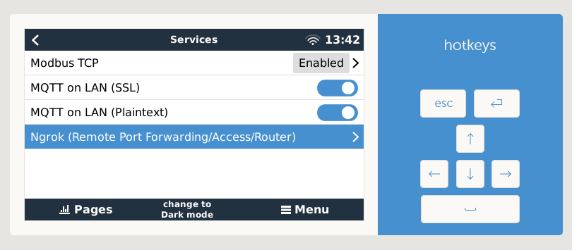
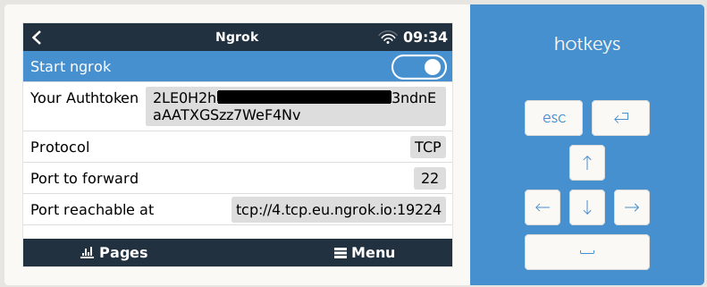

# venus-os_ngrok - Remote access without port forwarding with Ngrok

<small>GitHub repository: [mr-manuel/venus-os_ngrok](https://github.com/mr-manuel/venus-os_ngrok)</small>

### Disclaimer

I wrote this script for myself. I'm not responsible, if you damage something using my script.


### Purpose

I created this driver/packet for Venus OS that allows you to access a specific port on your Venus OS without the need to forward the port on your local router/firewall. It can for example be used to remote access the Venus OS device via SSH behind a mobile internet connection, VPN, firewall or anything else.

The driver is using ngrok as application to achieve that. Ngrok is like a router that forwards the port for you. In order to be able to do that, the application connects to a ngrok server, which is acting as a router, where then a dynamic port is opened for you. Then you can connect to the displayed hostname and port. For detailed informations on how ngrok works, visit their [website](https://ngrok.com).

In order to use ngrok you have to [create a free account](https://dashboard.ngrok.com/signup) first.





### Installation

⚠️ The [Setup Helper/Packet Manager](https://github.com/kwindrem/SetupHelper) is required for all installation methods.

The driver can be installed via the [Setup Helper/Packet Manager](https://github.com/kwindrem/SetupHelper), by uploading it via SFTP to the directory `/data/venus-os_ngrok` and then running the `setup` file or by running this commands:

```bash
wget -O /tmp/venus-os_ngrok.zip https://github.com/mr-manuel/venus-os_ngrok/archive/refs/tags/latest.zip

unzip /tmp/venus-os_ngrok.zip -d /data

chmod +x /data/venus-os_ngrok/service/run /data/venus-os_ngrok/service/log/run /data/venus-os_ngrok/setup /data/venus-os_ngrok/venus-os_ngrok.py

bash /data/venus-os_ngrok/setup
```

The configuration is done via remote console/GUI.

### Config

Access to the remote console/GUI &rarr; Settings &rarr; Services &rarr; Ngrok


## Supporting/Sponsoring this project

You like the project and you want to support me?

[](https://www.paypal.com/donate/?hosted_button_id=3NEVZBDM5KABW)
