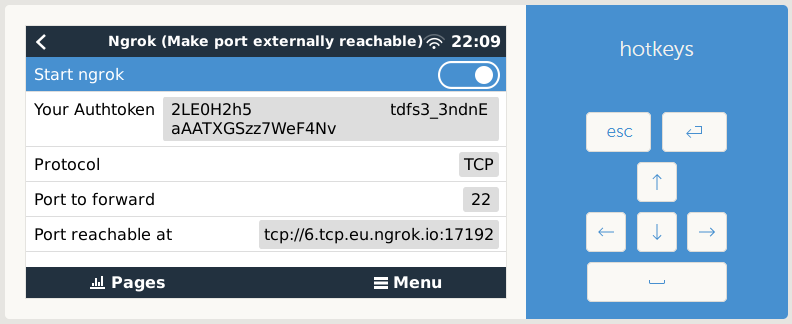

# venus-os_ngrok - Easy external access, makes port externally reachable

<small>GitHub repository: [mr-manuel/venus-os_ngrok](https://github.com/mr-manuel/venus-os_ngrok)</small>

### Disclaimer

I wrote this script for myself. I'm not responsible, if you damage something using my script.

### Purpose

The allows you to access one selectable port from an external connection without the need to forward the port.

### Config

Access to the remote console/GUI &rarr; Settings &rarr; Services &rarr; Ngrok

## Supporting/Sponsoring this project

You like the project and you want to support me?

